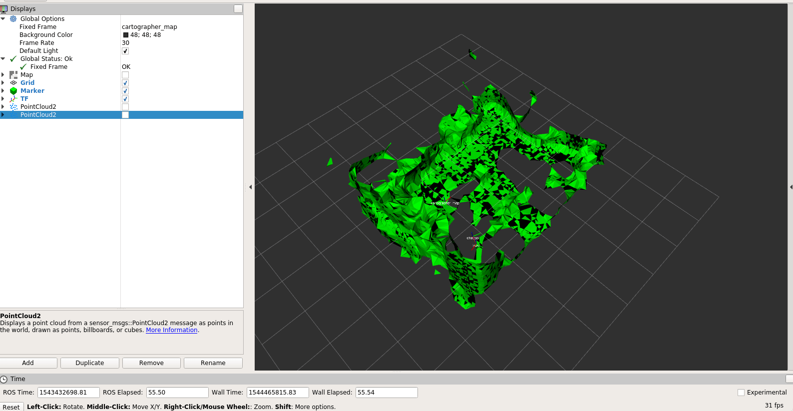

# Overview
This repository contains code for 3D mesh visualization for maps from Google Cartographer using the RACECAR Platform.
Google Folder with extra info: https://drive.google.com/drive/folders/1qsyozyxdApDVqJ8hbkELDZuu61G2x3S4

## Dependencies:

* [CGAL](https://www.cgal.org/)
* [PCL](http://pointclouds.org/)
* [Google Cartographer](https://github.com/googlecartographer)

## Demo:
`roslaunch racecar_3d_slam test_hallway_bag.launch`

